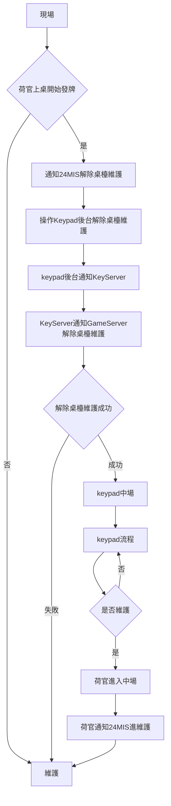

# HSG Keyserver API 規格書

## chart



## 注意事項
訊號目前是透過 `socket 協定` 傳輸，有可能會一次收到多筆 json 或是不完整的 json，目前訊號是透過斷行符號`/r/n`去分割訊息，這部份請自行處理或是利用自行利用 socket 相關的套件處理。

## API 位置
- 測試: keyserver.olacak.live:2580
- 正式機: keyserver.kasar.live:2580


## 維護
| Field   | Type   | Description                   |
| ------- | ------ |:----------------------------- |
| command | string | [牌桌狀態指令](#牌桌狀態指令) |
| type    | int    | [遊戲型別](#遊戲型別)         |
|id|string|牌桌桌號(會與其他遊戲共用桌號, 非唯一值)|
|time|timestamp|發送訊息時間|
|payload|object|資料依[牌桌狀態指令](#牌桌狀態指令)而異|
|&emsp;&emsp;maintenance|bool|是否維護中,true/false|

```json=

{
    "command":"X900",
    "type":1,
    "id":"A",
    "time":1602827720,
    "payload":{
        "maintenance": true // 維護狀態 true or false 
    }
}

```

## 中場

| Field   | Type   | Description                   |
| ------- | ------ |:----------------------------- |
| command | string | [牌桌狀態指令](#牌桌狀態指令) |
| type    | int    | [遊戲型別](#遊戲型別)         |
|id|string|牌桌桌號(會與其他遊戲共用桌號, 非唯一值)|
|time|timestamp|發送訊息時間|
|payload|object|資料依[牌桌狀態指令](#牌桌狀態指令)而異|

```json=

{
    "command":"X000",
    "type":1,
    "id":"A",
    "time":1602827720,
    "payload":null
}

```

## 遊戲中

| Field   | Type   | Description                   |
| ------- | ------ |:----------------------------- |
| command | string | [牌桌狀態指令](#牌桌狀態指令) |
| type    | int    | [遊戲型別](#遊戲型別)         |
|id|string|牌桌桌號(會與其他遊戲共用桌號, 非唯一值)|
|time|timestamp|發送訊息時間|
|payload|object|資料依[牌桌狀態指令](#牌桌狀態指令)而異|
|&emsp;&emsp;round|long|輪號|
|&emsp;&emsp;run|int|局號|
|&emsp;&emsp;status|int|[牌桌狀態](#牌桌狀態)|
|&emsp;&emsp;bettime|int|開始下注至結束下注秒數|
|&emsp;&emsp;cards|array|[數字牌型對應](#數字牌型對應)|
|&emsp;&emsp;dealer|object|荷官資料，牌桌狀態為`compute`(6) 才會帶值，其餘為`null`|
|&emsp;&emsp;&emsp;id|string|荷官ID|
|&emsp;&emsp;&emsp;name|string|荷官姓名|
|&emsp;&emsp;&emsp;photo|string|荷官圖片|

```json=
{
    "command":"X100",
    "type":1,
    "id":"A",
    "time":1602827720,
    "payload":{
        "round":1602827707,
        "run":1,
        "status":1,
        "bettime":30,
        "cards":[12,23,0,11,34,0],
        "dealer":{                 // if status is not compute(6), dealer will be null.
            "id":"123456",
            "name":"王小明"
            "photo":"http://XXXX.XXX.jpg"
        }
    }
}
```

## 更換荷官

| Field   | Type   | Description                   |
| ------- | ------ |:----------------------------- |
| command | string | [牌桌狀態指令](#牌桌狀態指令) |
| type    | int    | [遊戲型別](#遊戲型別)         |
|id|string|牌桌桌號(會與其他遊戲共用桌號, 非唯一值)|
|time|timestamp|發送訊息時間|
|payload|object|資料依[牌桌狀態指令](#牌桌狀態指令)而異|
|&emsp;&emsp;id|string|荷官ID|
|&emsp;&emsp;name|string|荷官姓名|
|&emsp;&emsp;photo|string|荷官圖片|

```json=
{
    "command":"X500",
    "type":1,
    "id":"A",
    "time":1602827720,
    "payload":{
        "id":"123456",
        "name":"王小明",
        "photo":"http://XXXX.XXX.jpg"
    }
}
```

## 牌桌狀態

| Number | Status    |
| ------ |:--------- |
| `1`    | newRound  |
| `2`    | newRun    |
| `3`    | startBet  |
| `4`    | endBet    |
| `5`    | deal      |
| `6`    | compute   |
| `7`    | cancelRun |

## 牌桌狀態指令
| Value  | Description |
|:------ |:----------- |
| `X000` | 中場        |
| `X100` | 遊戲中      |
| `X500` | 更換荷官    |
| `X900` | 維護        |

## 遊戲型別
| Value | Description |
|:----- |:----------- |
| `1`   | 百家樂      |
| `2`   | 骰寶        |
| `3`   | 輪盤        |
| `4`   | 色碟        |
| `5`   | 龍虎        |

## 數字牌型陣列對應
#### 0-52數字陣列
#### 1. 百家樂順序為:[Player1, Player2, Player3, Banker1, Banker2, Banker3] 注：補牌API部分因皇家2022/08/08提出修正修改為[P1, B1, P2, B2, P3, B3]
#### 2. 龍虎順序為:[Dragon, 0, 0, Tiger, 0, 0]
#### 3. 輪盤不適用以下數字排型對應, 順序第一個號碼為開出的號碼 : [Number, 0, 0, 0, 0, 0]
#### 4. 色碟不適用以下數字排型對應, 順序第一個號碼為紅色碟數量 : [Seide, 0, 0, 0, 0, 0]
#### 5. 骰寶不適用以下數字牌型對應, 順序為第一顆骰子, 第二顆骰子, 第三顆骰子 : [Dice1, Dice2, Dice3, 0, 0, 0]

| Number | Card      | Number | Card      | Number | Card      | Number | Card     |
|:------ | --------- | ------ | --------- |:------ | --------- | ------ |:-------- |
| `1`    | `黑桃 1`  | `14`   | `紅心 1`  | `27`   | `方塊 1`  | `40`   | `梅花1`  |
| `2`    | `黑桃 2`  | `15`   | `紅心 2`  | `28`   | `方塊 2`  | `41`   | `梅花2`  |
| `3`    | `黑桃 3`  | `16`   | `紅心 3`  | `29`   | `方塊 3`  | `42`   | `梅花3`  |
| `4`    | `黑桃 4`  | `17`   | `紅心 4`  | `30`   | `方塊 4`  | `43`   | `梅花4`  |
| `5`    | `黑桃 5`  | `18`   | `紅心 5`  | `31`   | `方塊 5`  | `44`   | `梅花5`  |
| `6`    | `黑桃 6`  | `19`   | `紅心 6`  | `32`   | `方塊 6`  | `45`   | `梅花6`  |
| `7`    | `黑桃 7`  | `20`   | `紅心 7`  | `33`   | `方塊 7`  | `46`   | `梅花7`  |
| `8`    | `黑桃 8`  | `21`   | `紅心 8`  | `34`   | `方塊 8`  | `47`   | `梅花8`  |
| `9`    | `黑桃 9`  | `22`   | `紅心 9`  | `35`   | `方塊 9`  | `48`   | `梅花9`  |
| `10`   | `黑桃 10` | `23`   | `紅心 10` | `36`   | `方塊 10` | `49`   | `梅花10` |
| `11`   | `黑桃 J`  | `24`   | `紅心 J`  | `37`   | `方塊 J`  | `50`   | `梅花J`  |
| `12`   | `黑桃 Q`  | `25`   | `紅心 Q`  | `38`   | `方塊 Q`  | `51`   | `梅花Q`  |
| `13`   | `黑桃 K`  | `26`   | `紅心 K`  | `39`   | `方塊 K`  | `52`   | `梅花K`  |


## Web API

### Endpoint


| 環境 | 位址 | 
| -------- | -------- | 
| Stage     | http://keypad.admin.olacak.live     | 
| Production | http://keypad.admin.kasar.live     |

### 取得路圖資料
> GET /casino-api/v2/roadmap/hs?tableId=F&round=1617867216&gameType=gameType

#### Query string
| 變數 | 型態 | 說明 |
| -------- | -------- | -------- |
| tableId | string | 桌號 |
| round | int | 輪號 選填 如果沒給會抓最新一輪的資料 |
| gameType | string | 遊戲類型 `Baccarat` `DragonTiger` |

#### Response
```json=
{
  "status": "success",
  "data": [
    {
      "TableName": "Baccarat", // 遊戲類型
      "HistoryId": 589927,     // 牌局紀錄編號
      "TableId": "BC01",          // 桌號
      "Round": 1602388403,     // 輪號
      "Run": 56,               // 局號
      "Result" : {
        "WinSpot": null,         // 輸贏注區
        "Cards": [0,0,0,0,0,0] //參考 數字牌型對應
      }
      "ModifiedStatus": "Canceled", // 狀態 Modified（改牌）, Canceled（取消）
      "ModifiedTime": "2020-10-11 12:34:58", // 修改時間
      "CreateTime": "2020-10-11 12:34:13" // 建立時間
    },
    ....
  ]
}
```

### 取得改單資料
建議每五分鐘調用一次即可
> GET /casino-api/v2/modify-game/hs?modifyTime=2020-10-10%2020:00:00

#### Query string

| 變數 | 型態 | 說明 |
| -------- | -------- | -------- |
| modifyTime     | DateTime     | 會撈取 `modifyTime` 之後有改單的注單，使用的時區為 GMT+8 時間。   |

#### Response

```json=
{
  "status": "success",
  "data": [
    {
      "TableName": "Baccarat", // 遊戲類型
      "HistoryId": 589927,     // 牌局紀錄編號
      "TableId": "BC01",          // 桌號
      "Round": 1602388403,     // 輪號
      "Run": 56,               // 局號
      "Result" : {
        "WinSpot": null,         // 輸贏注區
        "Cards": [0,0,0,0,0,0] //參考 數字牌型對應
      }
      "ModifiedStatus": "Canceled", // 狀態 Modified（改牌）, Canceled（取消）
      "ModifiedTime": "2020-10-11 12:34:58", // 修改時間
      "CreateTime": "2020-10-11 12:34:13" // 建立時間
    },
    ....
  ]
}
```


### 平板驗證
> POST /casino-api/live-auth/hs

#### Request parameter

| 變數 | 型態 | 說明 |
| -------- | -------- | -------- |
| gameType     | Enum    |  `Baccarat`、`DragonTiger`、`Roulette`   |
| tableId | String | 桌檯編號 |
| playerName | String | 玩家帳號 |
| verifyNumber| String | 四碼數字組成的字串 |


#### Response

```json=
{
    "status": "success",
    "data": {
        "gameType": "Baccarat",
        "tableId": "Q",
        "playerName": "Test123",
        "verifyNumber": "0000"
    }
}
```


### 查詢牌局

```
GET /casino-api/v2/game-history/hs?
    gameType=<gameType>&
    tableId=<tableId>&
    round=<round>&
    run=<run>
```

#### Request parameter

| 參數名稱 | 參數型態 |     說明    |
|:--------:|:--------:|:-----------:|
|  gameType |  string  |   遊戲類型   |
|  tableId  |  string  |  桌號 |
|  round   | int |    輪號    |
|  run   | int |    局號    |


#### Response

##### Success
```json=
{
    "status": "success",
    "data": {
        "TableName": "Baccarat", // 遊戲類型
        "HistoryId": 589927,     // 牌局紀錄編號
        "TableId": "BC01",          // 桌號
        "Round": 1602388403,     // 輪號
        "Run": 56,               // 局號
        "Result" : {
        "WinSpot": null,         // 輸贏注區
            "Cards": [0,0,0,0,0,0] //參考 數字牌型對應
        }
        "ModifiedStatus": "Canceled", // 狀態 Modified（改牌）, Canceled（取消）
        "ModifiedTime": "2020-10-11 12:34:58", // 修改時間
        "CreateTime": "2020-10-11 12:34:13" // 建立時間
    }
}
```

##### Failed
```json=
{
    "status": "success",
    "data": null
}
```


## 視訊位址
目前提供 1080p 、 720p 和 420p 三種位址 格式如下

### 百家樂
| 解析度 | 格式 | 範例 |
| -------- | -------- | -------- |
| 1080p     | https://play.kasar.live/bacc/{桌號}-1080.flv     | https://play.kasar.live/bacc/bc01-1080.flv     |
| 720p     | https://play.kasar.live/bacc/{桌號}-720.flv     | https://play.kasar.live/bacc/bc01-720.flv     |
| 480p     | https://play.kasar.live/bacc/{桌號}-480.flv     | https://play.kasar.live/bacc/bc01-480.flv     |

### 龍虎
| 解析度 | 格式 | 範例 |
| -------- | -------- | -------- |
| 1080p     | https://play.kasar.live/dt/{桌號}-1080.flv     | https://play.kasar.live/dt/dt01-1080.flv     |
| 720p     | https://play.kasar.live/dt/{桌號}-720.flv     | https://play.kasar.live/dt/dt01-720.flv     |
| 480p     | https://play.kasar.live/dt/{桌號}-480.flv     | https://play.kasar.live/dt/dt01-480.flv     |

### 輪盤

| 解析度 | 格式 | 範例 |
| -------- | -------- | -------- |
| 1080p     | https://play.kasar.live/rt/{桌號}-1080.flv     | https://play.kasar.live/rt/rt01-1080.flv     |
| 720p     | https://play.kasar.live/rt/{桌號}-720.flv     | https://play.kasar.live/rt/rt01-720.flv     |
| 480p     | https://play.kasar.live/rt/{桌號}-480.flv     | https://play.kasar.live/rt/rt01-480.flv     |

### 色碟

| 解析度 | 格式 | 範例 |
| -------- | -------- | -------- |
| 1080p     | https://play.kasar.live/sd/{桌號}-1080.flv     | https://play.kasar.live/sd/sd01-1080.flv     |
| 720p     | https://play.kasar.live/sd/{桌號}-720.flv     | https://play.kasar.live/sd/sd01-720.flv     |
| 480p     | https://play.kasar.live/sd/{桌號}-480.flv     | https://play.kasar.live/sd/sd01-480.flv     |

### 骰寶

| 解析度 | 格式 | 範例 |
| -------- | -------- | -------- |
| 1080p     | https://play.kasar.live/sb/{桌號}-1080.flv     | https://play.kasar.live/sb/sb01-1080.flv     |
| 720p     | https://play.kasar.live/sb/{桌號}-720.flv     | https://play.kasar.live/sb/sb01-720.flv     |
| 480p     | https://play.kasar.live/sb/{桌號}-480.flv     | https://play.kasar.live/sb/sb01-480.flv     |


### 開放桌號

#### 百家樂
- BC01
- BC02
- BC03
- BC04
- BC05
- BC06
- BC07
- BC08
- BC09
- BC10
- BC11
- BC12
- BC99(測試桌，只有測試環境有)

#### 龍虎 
- DT01
- DT99(測試桌，只有測試環境有)

#### 輪盤
- RT01
- RT99(測試桌，只有測試環境有)

#### 色碟
- SD01
- SD02
- SD99(測試桌，只有測試環境有)

#### 骰寶
- SB01
- SB02
- SB99(測試桌，只有測試環境有)

## 錄影位址

```text
http:s//play.kasar.live/<遊戲名稱代碼>/<桌號>/<輪號>/<輪號>-<局號>.mp4
```
桌號請參考[開放卓號](#開放桌號)，桌號需要轉小寫，遊戲名稱代碼請參考下方表格，輪號局號為API取得。
### 遊戲名稱代碼


| 遊戲 | 代碼 | 
| -------- | -------- |
| 百家樂     | baccarat     |
| 龍虎 | dragon_tiger |
| 輪盤 | roulette |
| 色諜 | sedie |
| 骰寶 | sicbo |
